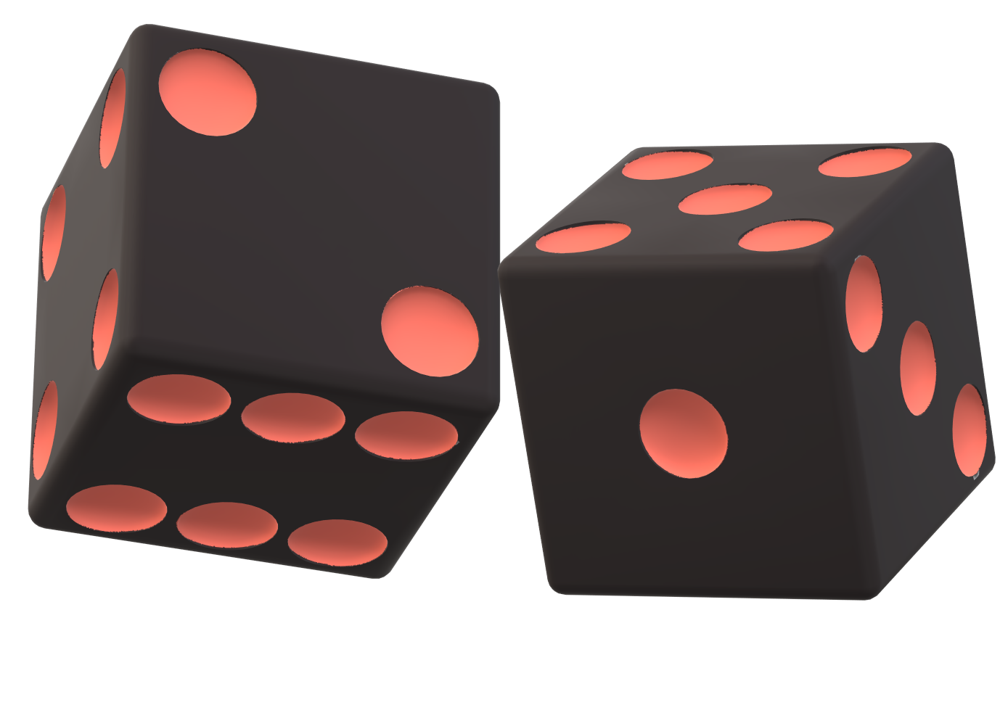
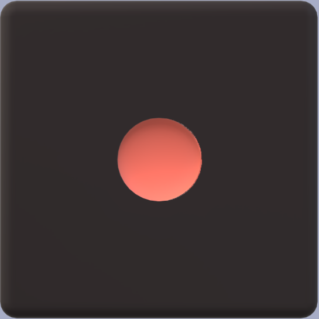

# Yahtzee

*This file will document the design for the yahtzee gameplay.*
<link rel="preconnect" href="https://fonts.googleapis.com">
<link rel="preconnect" href="https://fonts.gstatic.com" crossorigin>
<link href="https://fonts.googleapis.com/css2?family=Fira+Sans:ital,wght@0,200;0,400;0,600;1,400;1,600&display=swap" rel="stylesheet">

## Fonts and Type Scale

**{font-family: 'Fira Sans', sans-serif;}**

The font-family  Fira Sans  is used.

| Element name   | Font Features |
| ------------ | ------------ |
|  Header   |   Bold 600, 35px-75px   |
|  TABLE HEADINGS   |   BOLD 600, ALLCAPS, 16px    |
|  Table elements   |    Medium 400, 16px    |
|  Table total   |   Bold 600, 16px    |
|  _Hints_   |   _Light 200, 14px, italic_    |
| Footer   |   Bold 600, Heading style (h4)  |

## Colour palette ##

1A090D (Xiketic) colour is used as background colour for header, footer, dices and buttons, as text color for hints

A7ADC6 (Wild Blue Yonder) colour is used as background colour for gameboard and hints as well as text color for buttons

ED6A5A (Terra Cotta) colour is used for decorations and borders

56667A (Dark Electric Blue) colour is used as text colour for scoreboard and the hover colour of the button

F4F1BB (Pale Spring Bud) colour is used as background colour for scoreboard and as text color for header and footer

## Icons

For decorations:  
 </img>
 

For contact fields:  
 &nbsp; &nbsp; &nbsp;
 &nbsp; &nbsp; &nbsp; 

## UI Components

### Header

background colour 1A090D 

text colour F4F1BB, text is curved

position: on top of the page

   

### Game board

### Dices

 </img>
 </img>
 </img>
 </img>
 </img>
 </img>

### Scoreboard

Scoreboard has a hint pop-up message that appear on hover. 

### Buttons 

### Footer

