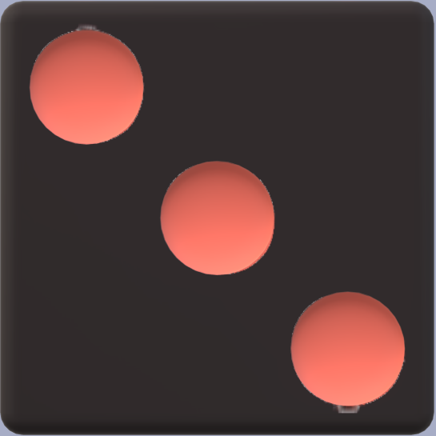
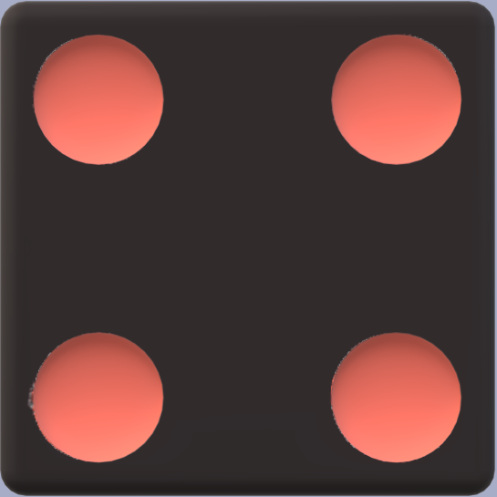

# Yahtzee

*This file will document the design for the yahtzee gameplay.*
<link rel="preconnect" href="https://fonts.googleapis.com">
<link rel="preconnect" href="https://fonts.gstatic.com" crossorigin>
<link href="https://fonts.googleapis.com/css2?family=Fira+Sans:ital,wght@0,200;0,400;0,600;1,400;1,600&display=swap" rel="stylesheet">

## Fonts and Type Scale

**{font-family: 'Fira Sans', sans-serif;}**

The font-family  Fira Sans  is used.

| Element name   | Font Features |
| ------------ | ------------ |
|  Header   |   Bold 700, 20px   |
|  Headings   |   Bold 700, 20px    |
|  Subtitles   |    Bold 700, 18px    |
|  Paragraphs   |   Medium 500, 16px    |
|  _Places_   |   _Medium 500, 16px, italic_    |
| Links  |   Medium 500, Heading style (h4)  |

## Colour palette

1A090D (black) colour is used as background colour for header, footer, dices and buttons, 
as text color for gameboard, and as border colour

A74DC6 (light blue) colour is used as 

ED6A5A (terra cotta) colour  is used for decorations and borders

56667A (dark blue) colour is used as 

F4F1BB (light yellow) colour is used as background colour for graphical elements, 
and as text color for header, footer, buttons

## Icons

For decorations:  
 </img>
 

For contact fields:  
 &nbsp; &nbsp; &nbsp;
 &nbsp; &nbsp; &nbsp; 

----

## UI Components

### Header

background colour 1A090D 

text colour F4F1BB, text is curved

position: on top of the page

   

### Game board

### Dices

 </img>
 </img>
 </img>
 </img>
 </img>
 </img>

### Scoreboard

### Buttons 

### Footer

